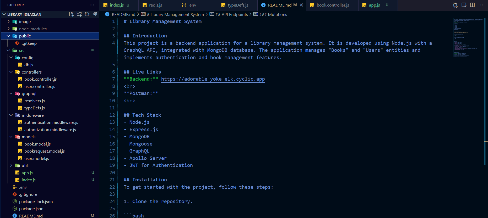

# Library Management System

## Introduction
This project is a backend application for a library management system. It is developed using Node.js with a GraphQL API, integrated with MongoDB database. The application manages "Books" and "Users" entities and implements authentication and book management features.

## Live Links
**Backend:** https://adorable-yoke-elk.cyclic.app
<br>
**Postman:** https://www.postman.com/raghavbhatirv/workspace/graph-ql-ideaclan
<br>

## Tech Stack
- Node.js
- Express.js
- MongoDB
- Mongoose
- GraphQL
- Apollo Server
- JWT for Authentication

## Installation
To get started with the project, follow these steps:

1. Clone the repository.

```bash
https://github.com/Raghavbhati/EduHub-IdeaClan.git
```

2. Install the dependencies using.

```bash
npm install
```

3. Start the application by running.

```bash
npm run dev
```


## API Endpoints
### Queries
- `users`: Get all users
- `user(id)`: Get a user by ID
- `books`: Get all books
- `book(id)`: Get a book by ID
- `searchBooks(title)`: Search books by title

### Mutations
- `addUser(email, password, role)`: Register a new user
- `loginUser(email, password)`: Login a user
- `updateUser(email, password)`: Update a user's details
- `deleteUser()`: Delete a user
- `addBook(title, author, publishedYear)`: Add a new book (Admin only)
- `updateBook(id, title, author, publishedYear)`: Update a book's details (Admin only)
- `deleteBook(id)`: Delete a book (Admin only)
- `borrowBook(bookId)`: Borrow a book
- `buyBook()`: Buy a book


##File Structure



## Important links:

**Portfolio:** https://www.raghavbhatirv.in/
<br>
**Github:** https://github.com/Raghavbhati
<br>
**Linkdin:** https://www.linkedin.com/in/raghavbhatirv/
<br>
**Twitter:** https://twitter.com/raghavbhatirv/